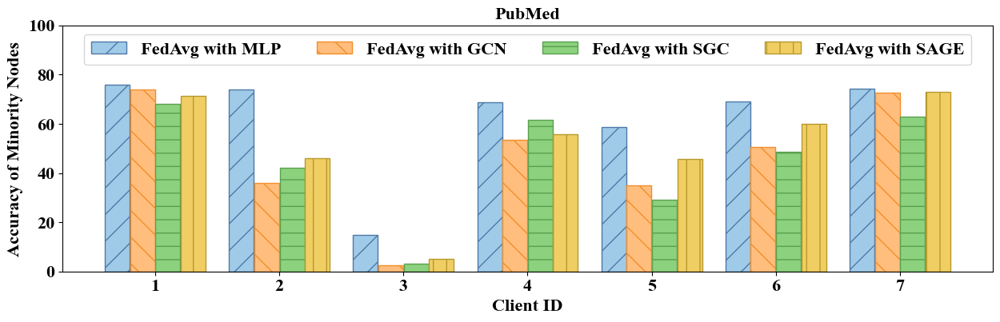
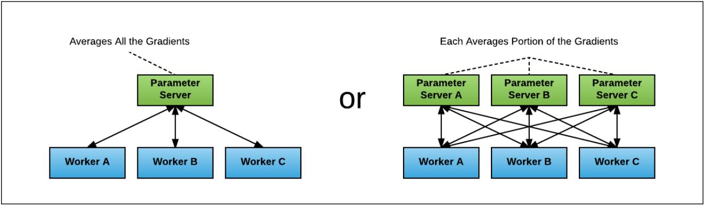

# Rebuttal Tables and Figures 

---

<b> Figure 1: Classification accuracy (%) of FedSpray on all nodes and minority nodes with different values of &lambda;1. </b>

---

<b> Table 1: Classification accuracy (%) of FedSpray on WikiCS with GraphSAGE and Physics with GCN under different values of &sigma;. </b>
  
|  WikiCS   |  $\sigma=0.1$  |  $\sigma=0.5$  |   $\sigma=1$   |  $\sigma=5$    |
|-----------|----------------|----------------|----------------|----------------|
| Overall   | 81.70 $\pm$ 0.82 | 81.16 $\pm$ 0.65 | 80.04 $\pm$ 1.34 | 68.23 $\pm$ 2.14 |
| Minority  | 52.27 $\pm$ 0.91 | 50.49 $\pm$ 1.29 | 49.46 $\pm$ 2.31 | 24.79 $\pm$ 1.37 |

|  Physics  |  $\sigma=0.1$  |  $\sigma=0.5$  |   $\sigma=1$   |  $\sigma=5$    |
|-----------|----------------|----------------|----------------|----------------|
| Overall   | 95.64 $\pm$ 0.43 | 95.71 $\pm$ 0.59 | 95.65 $\pm$ 0.52 | 95.18 $\pm$ 0.94 |
| Minority  | 81.17 $\pm$ 1.24 | 80.43 $\pm$ 1.18 | 80.08 $\pm$ 1.70 | 78.37 $\pm$ 1.42 |

---

  
<b> Table 2: Classification accuracy (%) of FedSpray with GAT.</b>

  
| PubMed   |    Overall  |   Minority  |
|-----------|--------------|--------------|
| Local    |83.44 $\pm$ 0.23|35.25 $\pm$ 2.78|
| Fedavg   |84.20 $\pm$ 1.00|51.64 $\pm$ 3.64|
|  APFL    |85.11 $\pm$ 0.61|41.09 $\pm$ 4.36|
|  GCFL    |82.75 $\pm$ 0.33|38.93 $\pm$ 3.35|
|  FedStar  |83.30 $\pm$ 0.78|27.77 $\pm$ 4.52|
| FedLit   |85.38 $\pm$ 0.52|53.88 $\pm$ 2.13|
| FedSpray  |86.03 $\pm$ 1.06|59.64 $\pm$ 1.21|

|  Physics  |    Overall  |   Minority  |
|-----------|--------------|--------------|
| Local    |88.03 $\pm$ 0.37|39.32 $\pm$ 3.01|
| Fedavg   |84.87 $\pm$ 0.86|52.01 $\pm$ 1.67|
|  APFL    |85.22 $\pm$ 1.02|30.45 $\pm$ 2.13|
|  GCFL    |85.99 $\pm$ 0.87|42.68 $\pm$ 7.01|
|  FedStar  |90.88 $\pm$ 0.78|40.14 $\pm$ 6.81|
| FedLit   |93.87 $\pm$ 0.21|65.66 $\pm$ 2.28|
| FedSpray  |95.57 $\pm$ 0.24|81.00 $\pm$ 1.35|

---

<b> Table 3: AUC with GraphSAGE over WikiCS and Physics.</b>

| Model    |   WikiCS   |  Physics    |
|-----------|--------------|--------------|
| Local    |92.86 $\pm$ 0.83|97.99 $\pm$ 0.08|
| Fedavg   |95.19 $\pm$ 1.25|99.16 $\pm$ 0.12|
|  APFL    |95.17 $\pm$ 0.82|89.85 $\pm$ 6.45|
|  GCFL    |91.45 $\pm$ 2.26|96.94 $\pm$ 0.22|
|  FedStar  |91.76 $\pm$ 0.50|98.52 $\pm$ 0.09|
| FedLit   |93.50 $\pm$ 0.96|98.47 $\pm$ 0.13|
| FedSpray  |95.59 $\pm$ 0.75|99.39 $\pm$ 0.06|

---

<b> Figure 2: Classification accuracy (%) of minority nodes in each client by training MLP and various GNN models via FedAvg over PubMed and WikiCS.</b>

---

<b> Table 4: The information about label distribution of the four datasets adopted for our experiments. Numbers in bold represent majority classes in each client. The rest are minority classes.</b>

|   PubMed     |   Label=0   |   Label=1   |   Label=2   |
|-----------------|---------------|---------------|---------------|
| Client  1     |      17    |    **1,384**    |     367    |
| Client  2     |      31    |    **1,263**    |     121    |
| Client  3     |     265    |      21    |    **2,001**    |
| Client  4     |      16    |      81    |    **1,236**    |
| Client  5     |      28    |    **1,160**    |     112    |
| Client  6     |     **934**    |     258    |     209    |
| Client  7     |     173    |     633    |     **948**    |
  

| WikiCS    |  Label=0   | Label=1  | Label=2 |  Label=3 |  Label=4 |  Label=5 |  Label=6 |  Label=7 |  Label=8 |  Label=9 |
|------------|-------------|----------|---------|----------|----------|----------|----------|----------|----------|----------|
| Client  1  |        0 |      3 |    **406** |     74 |     21 |     14 |     17 |     23 |      5 |      8 |
| Client  2  |       16 |     36 |     87 |     39 |     25 |     15 |      1 |     62 |     61 |  **1,140** |
| Client  3  |        0 |      3 |     73 |     23 |    222 |    **543** |     29 |     61 |      9 |     11 |
| Client  4  |        0 |      3 |    **210** |    164 |     28 |     11 |      6 |     14 |      4 |      9 |
| Client  5  |        0 |     18 |    **323** |     27 |     41 |      5 |     19 |     14 |     17 |     10 |
| Client  6  |        0 |      2 |     49 |    **806** |     21 |      5 |     13 |     94 |      3 |     29 |
| Client  7  |        1 |     20 |     13 |      4 |     98 |      7 |      7 |    **354** |     29 |      1 |
| Client  8  |        1 |     16 |     36 |      5 |  **1,900** |     24 |     10 |     31 |     25 |      7 |
| Client  9  |        2 |     14 |    **573** |    153 |     36 |     12 |     32 |     22 |      3 |     44 |
| Client 10  |        0 |      2 |     99 |    **525** |      6 |      2 |      4 |     27 |      2 |      3 |
| Client 11  |        4 |    **391** |      9 |     23 |     27 |      9 |      1 |     34 |     12 |     23 |
| Client 12  |        1 |     26 |     18 |     30 |    108 |    105 |      5 |     50 |    **278** |     50 |

|    Physics    |  Label=0   |   Label=1   |   Label=2   |   Label=3    |  Label=4    |
|-----------------|-------------|---------------|---------------|----------------|--------------|
| Client  1    |         6   |      17   |   **2,594**   |       8   |      55   |
| Client  2    |         6   |      11   |   **2,790**   |       2   |      32   |
| Client  3    |     **4,031**   |      72   |      32   |      43   |      26   |
| Client  4    |         0   |      27   |     **976**   |       2   |      76   |
| Client  5    |        59   |   **2,802**   |   1,415   |       8   |     158   |
| Client  6    |     **1,225**   |      70   |      44   |     440   |      41   |
| Client  7    |         1   |      40   |   **2,794**   |       2   |      53   |
| Client  8    |       177   |      87   |      65   |   **2,070**   |      55   |
| Client  9    |        56   |     347   |     449   |       4   |   **2,262**   |
| Client 10    |         3   |      46   |   **1,560**   |       5   |      25   |
| Client 11    |        23   |   **1,153**   |     174   |       7   |      54   |
| Client 12    |         6   |      96   |   **3,057**   |       3   |      71   |

| Flickr    |  Label=0   | Label=1  | Label=2 |  Label=3 |  Label=4 |  Label=5 |  Label=6 |
|------------|-------------|----------|---------|----------|----------|----------|----------|
| Client  1  |      211 |    274 |    182 |    122 |    188 |    332 |  **3,808** |
| Client  2  |      423 |    668 |    645 |    671 |  **4,197** |    284 |  2,544 |
| Client  3  |      918 |  2,257 |    899 |    674 |  3,666 |    436 |  **5,770** |
| Client  4  |      337 |  1,734 |    275 |    260 |  2,752 |    142 |  **4,164** |
| Client  5  |      252 |    204 |    149 |     87 |    160 |    160 |  **2,482** |
| Client  6  |       24 |     25 |     21 |     14 |    106 |     18 |    **223** |
| Client  7  |    1,285 |  1,156 |  1,998 |  1,498 |  **6,190** |    710 |  5,420 |
| Client  8  |       24 |     36 |     10 |     14 |     52 |     40 |    **223** |
| Client  9  |       66 |     75 |    106 |    128 |    243 |     81 |    **523** |
| Client 10  |       96 |    150 |    108 |     40 |    182 |     74 |    **499** |
| Client 11  |       59 |     72 |    114 |     65 |    224 |     64 |    **482** |
| Client 12  |      401 |    303 |    578 |    229 |    679 |    375 |  **2,702** |
| Client 13  |       27 |     34 |     44 |     36 |    142 |     74 |    **249** |
| Client 14  |       71 |     81 |     71 |     67 |    137 |     55 |    **539** |
| Client 15  |      210 |    164 |    120 |     79 |    191 |    156 |  **1,573** |
| Client 16  |      563 |    948 |    791 |    746 |  3,298 |    246 |  **4,144** |
| Client 17  |       64 |     77 |     62 |     35 |     87 |     35 |    **596** |
| Client 18  |      136 |    100 |    101 |     40 |    146 |    123 |    **955** |
| Client 19  |       48 |     38 |     35 |     46 |    106 |     25 |    **281** |
| Client 20  |       31 |     57 |     68 |     32 |    162 |     28 |    **310** |

---

<b> Table 5: Classification accuracy (%) of FedALA on PubMed and Physics with different GNN backbones.</b>
  
<table>
   <tr style="border-top: 2px solid #000;">
  <tr>
      <th style="font-weight: bold;">Dataset</th>
      <th style="font-weight: bold;">GNNs</th>
      <th style="font-weight: bold;">Overall</th>
      <th style="font-weight: bold;">Minority</th>
  </tr>
   <tr style="border-bottom: 1.5px solid #000;">
  <tr>
    <td rowspan="3">PubMed</td>
    <td>GCN</td>
    <td>87.02 $\pm$ 0.82</td>
    <td>54.94 $\pm$ 1.61</td>
  </tr>
  <tr>
    <td>SGC</td>
    <td>87.01 $\pm$ 0.76</td>
    <td>46.44 $\pm$ 1.33</td>
  </tr>
  <tr>
    <td>GraphSAGE</td>
    <td>86.47 $\pm$ 0.56</td>
    <td>55.11 $\pm$ 1.51</td>
  </tr>
  <tr style="border-bottom: 1.5px solid #000;">
  <tr>
    <td rowspan="3">Physics</td>
    <td>GCN</td>
    <td>94.66 $\pm$ 0.25</td>
    <td>78.89 $\pm$ 0.95</td>
  </tr>
  <tr>
    <td>SGC</td>
    <td>94.74 $\pm$ 0.22</td>
    <td>70.73 $\pm$ 0.58</td>
  </tr>
  <tr>
    <td>GraphSAGE</td>
    <td>94.40 $\pm$ 0.35</td>
    <td>76.12 $\pm$ 1.44</td>
  </tr>
    
  <tr style="border-bottom: 2px solid #000;">
</table>

---

<b> Table 6: Classification accuracy (%) of FedSpray over the ogbn-arxiv dataset with GraphSAGE as the backbone.</b>

|Method|Overall|Minority|
|-|-|-|
| Local    |64.42 $\pm$ 0.50|37.05 $\pm$ 0.18|
| Fedavg   |54.38 $\pm$ 0.67|38.21 $\pm$ 1.35|
|  APFL    |61.71 $\pm$ 0.55|36.09 $\pm$ 0.63|
|  GCFL    |48.07 $\pm$ 1.05|28.08 $\pm$ 1.43|
|  FedStar  |58.97 $\pm$ 0.74|26.49 $\pm$ 2.11|
| FedLit   |52.03 $\pm$ 0.81|36.42 $\pm$ 0.76|
| FedSpray  |64.82 $\pm$ 0.22|40.06 $\pm$ 0.65|

---

<b> Table 7: Classification accuracy (%) of FedSpray with shared GCN parameters.</b>

<table>
   <tr style="border-top: 2px solid #000;">
  <tr>
      <th style="font-weight: bold;">Dataset</th>
      <th style="font-weight: bold;">Method</th>
      <th style="font-weight: bold;">Overall</th>
      <th style="font-weight: bold;">Minority</th>
  </tr>
   <tr style="border-bottom: 1.5px solid #000;">
  <tr>
    <td rowspan="2">PubMed</td>
    <td>FedSpray</td>
    <td>82.20 $\pm$ 4.14</td>
    <td>53.81 $\pm$ 2.92</td>
  </tr>
  <tr>
    <td>FedSpray(<strong>S=0</strong>)</td>
    <td>81.03 $\pm$ 2.34</td>
    <td>50.49 $\pm$ 2.80</td>
  </tr>
  <tr style="border-bottom: 1.5px solid #000;">
  <tr>
    <td rowspan="2">Physics</td>
    <td>FedSpray</td>
    <td>94.15 $\pm$ 0.72</td>
    <td>69.31 $\pm$ 2.11</td>
  </tr>
  <tr>
    <td>FedSpray(<strong>S=0</strong>)</td>
    <td>93.68 $\pm$ 0.55</td>
    <td>67.10 $\pm$ 1.65</td>
  </tr>    
  <tr style="border-bottom: 2px solid #000;">
</table>

---

# Official Code for FedSpray

### Structure
data/: the folder to store data files

partition/: the folder including partition results for each dataset

client.py: the Client class

data.py: load data

main.py: run experiment

model.py: the model zoo including models used

server.py: the Server class

utils.py: get subgraph; get global proxy

### Usage

python main.py
